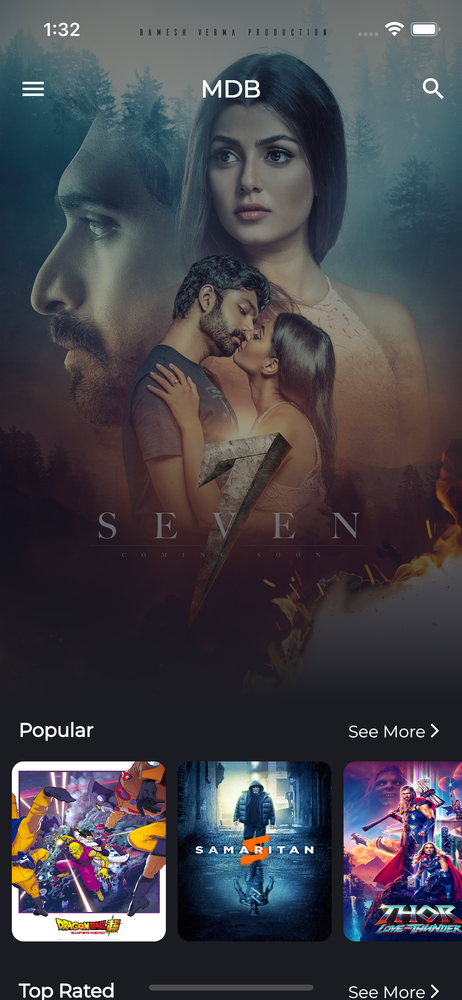
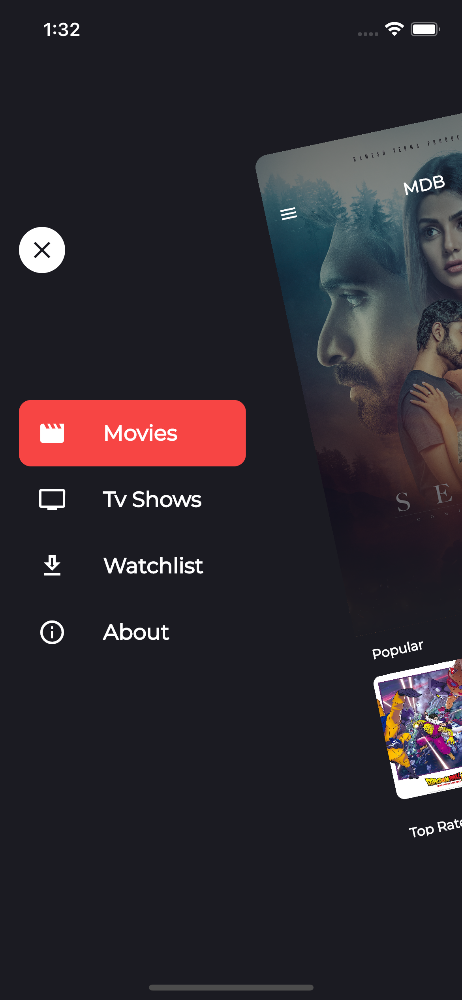
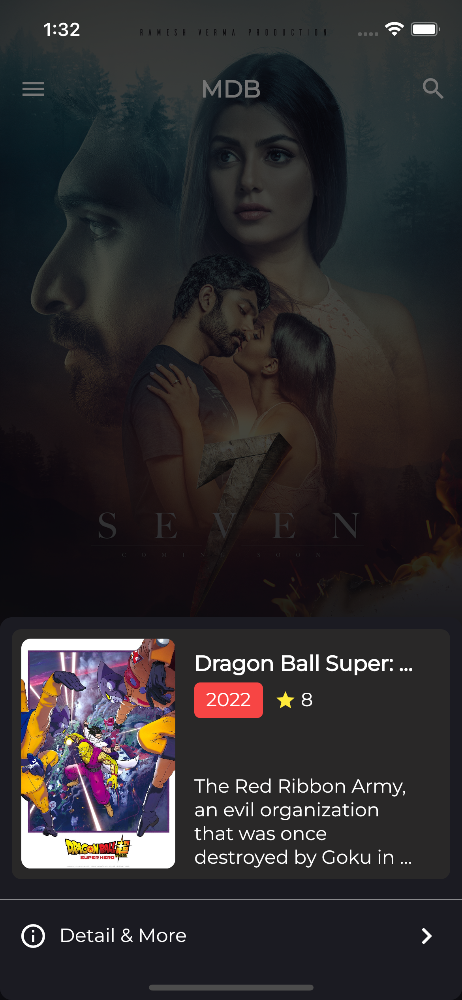
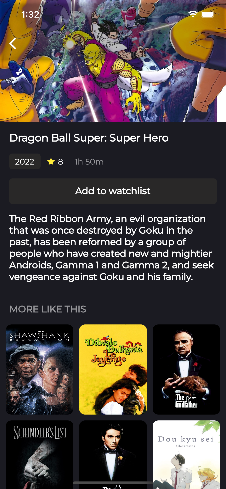

# Movie App Clone
1. Functional programming pfdart used for error and data handling.
2. http packed used for network operation
3. Bloc & Riverpod used for state management
4. usecase and repository pattern used
5. GetIt used for dependency management 

# Screenshot 
<table>
  <tr>
    <td>Dashboard</td>
     <td>Drawer</td>
  </tr>
  <tr>
    <td></td>
    <td></td>
   </tr>
  <tr>
    
   <td>Detail Sheet Info</td>
   <td>Detail Page</td>
  </tr>
  <tr>
   <td></td>
    <td></td>
  
  </tr>
 </table>